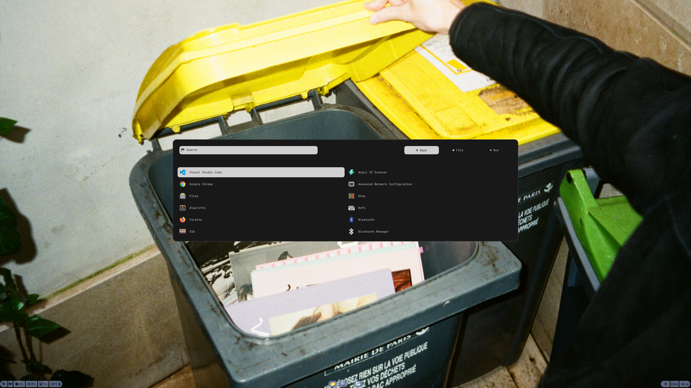
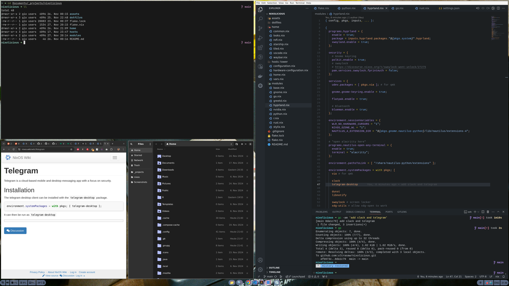
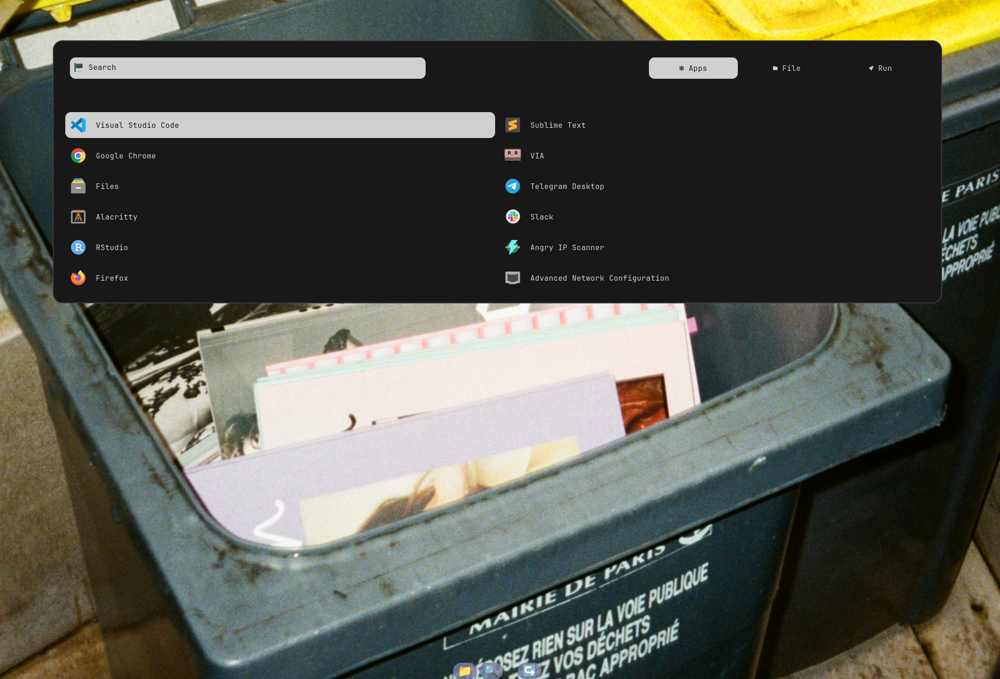

# nixolicious

## what's inside
- browser - chrome, firefox
- text editor / IDE - helix, vscode, obsidian
- talking - telegram, slack
- coding - golang, rust, python, r
- dev tools - docker, kubectl, k9s, opentofu
- shell - zsh + oh-my-zsh + starship
- terminal emulator - kitty (I have two cats now, so alacritty had to go)
- compositor & related - niri; rofi, waybar, nautilus
- misc - zellij, eza, zoxide, ripgrep, fzf, yazi, bat

## showcase




## commands

```bash
sudo nixos-rebuild switch --flake .#tower
sudo nixos-rebuild boot --flake .#tower # build the new configuration and make it the boot default, but do not activate it.
sudo nixos-rebuild build --flake .#tower # neither activate it nor add it to the GRUB boot menu.

sudo nix-env -p /nix/var/nix/profiles/system --delete-generations +10
sudo nix-collect-garbage --delete-old
sudo nix-store --delete --ignore-liveness
```

## extras
Hyprland and Gnome also available; edit the following:
- `flake.nix` - `nixosConfiguration.<HOST>` section in order to include the necessary modules;
- `hosts/<HOST>/home.nix` - `imports` to include the user environment modules & settings.
