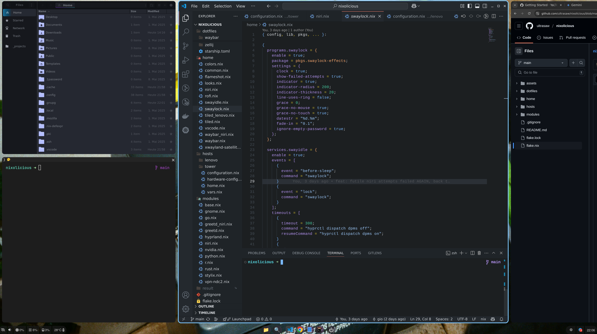

# nixolicious

# what's inside
- browser - chrome, firefox
- text editor / IDE - nvim, sublime, vscode
- talking - telegram, slack
- coding - golang, rust, python, r
- dev tools - docker, kubectl, k9s 
- shell - zsh + oh-my-zsh + starhip
- terminal emulator - alacritty
- compositor & related - hyprland; rofi, waybar, nautilus

# showcase

